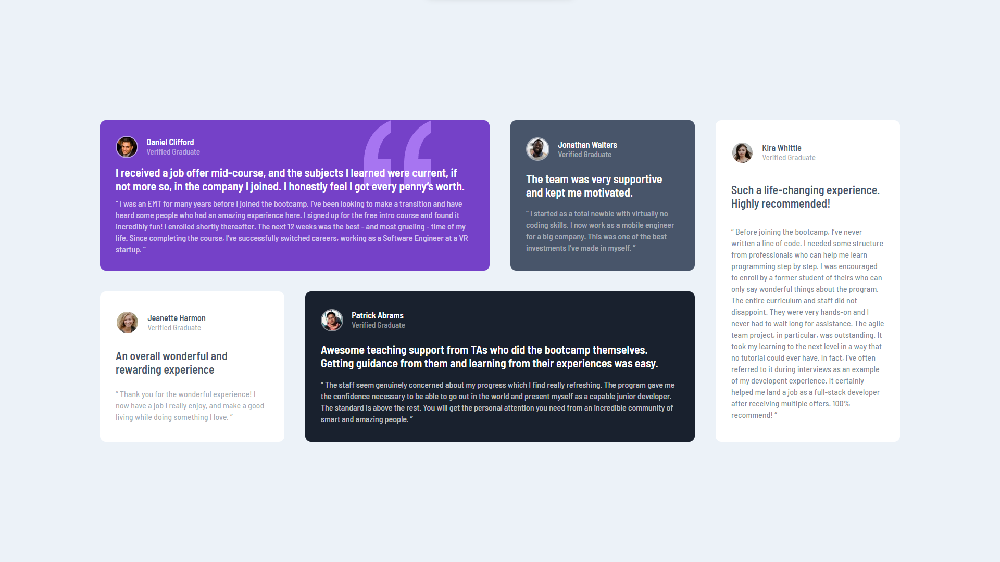

# Frontend Mentor - Testimonials grid section solution

This is a solution to the [Testimonials grid section challenge on Frontend Mentor](https://www.frontendmentor.io/challenges/testimonials-grid-section-Nnw6J7Un7). Frontend Mentor challenges help you improve your coding skills by building realistic projects. 

## Table of contents

- [Frontend Mentor - Testimonials grid section solution](#frontend-mentor---testimonials-grid-section-solution)
  - [Table of contents](#table-of-contents)
  - [Overview](#overview)
    - [The challenge](#the-challenge)
    - [Screenshot](#screenshot)
    - [Links](#links)
  - [Author](#author)
## Overview

### The challenge

Users should be able to:

- View the optimal layout for the site depending on their device's screen size

### Screenshot

### Links

- Solution URL: [Frontend Mentor](https://www.frontendmentor.io/challenges/testimonials-grid-section-Nnw6J7Un7/hub)
- Live Site URL: [Vercel](https://testimonials-grid-section-fawn-gamma.vercel.app)

## Author

- Website - [Justin Vera](https://www.justinvera.com)
- Frontend Mentor - [@justinnvera](https://www.frontendmentor.io/profile/justinnvera)
